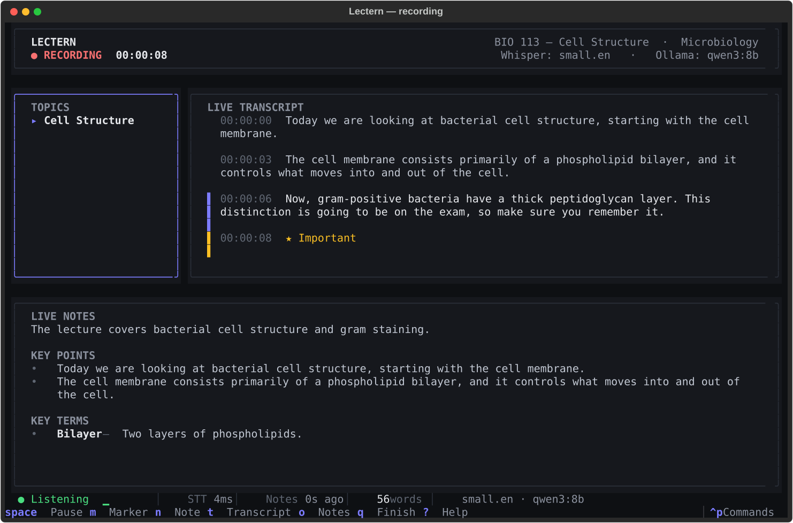
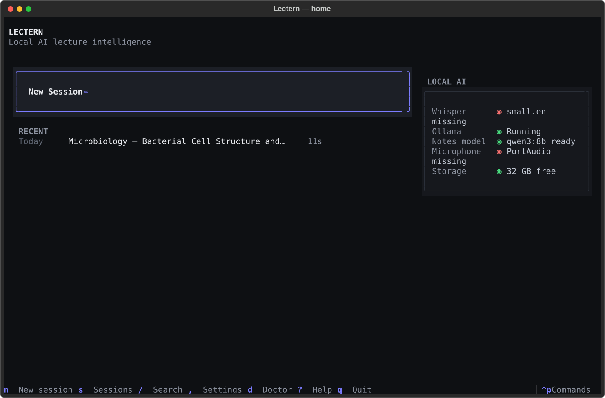
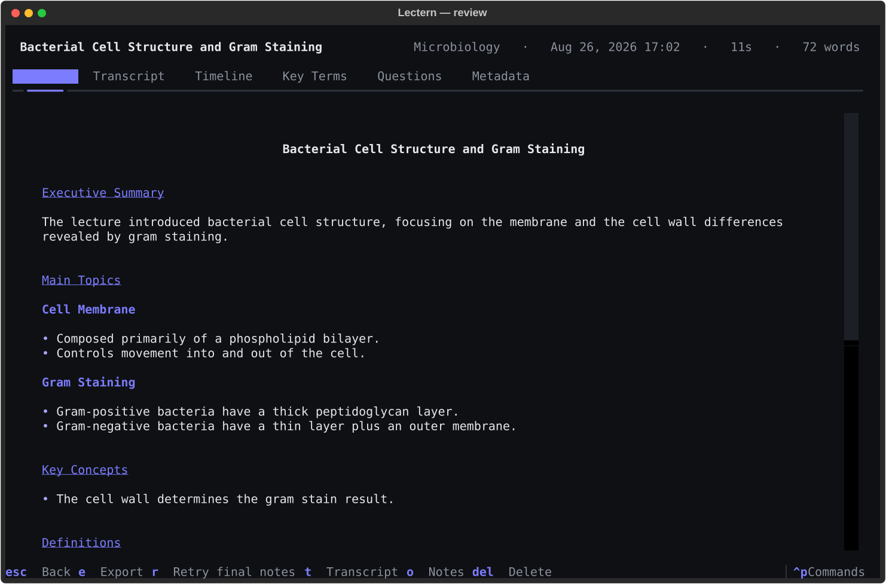

# Lectern

**Local AI lecture intelligence, in your terminal.**

Lectern records a lecture, transcribes it live with [whisper.cpp](https://github.com/ggerganov/whisper.cpp),
and writes structured notes as it happens with a local model served by
[Ollama](https://ollama.com). When you finish, it produces a study guide from the
whole transcript.

Everything runs on your Mac. There is no account, no upload, no API key.

> **Your lectures stay on your Mac.**

```
Live audio → whisper.cpp → live transcript → Ollama → continuously updating notes
```



---

## What it does

You sit down in class, run `lectern`, press <kbd>Enter</kbd> on **New Session**,
type a title, and start recording. Then you can ignore it:

- Speech is transcribed locally as it is spoken.
- Notes appear beside the transcript and evolve — topics, key points,
  definitions, examples, formulas, questions, and things worth clarifying.
- Anything the lecturer emphasises ("this will be on the exam") gets starred.
- Press <kbd>m</kbd> to flag a moment, <kbd>n</kbd> to type a quick note.
- Everything is written to disk continuously, so a crash costs you seconds.

Press <kbd>q</kbd> and Lectern writes a full study guide from the whole lecture.

| | |
|---|---|
|  |  |

---

## Requirements

| | |
|---|---|
| macOS | 13 (Ventura) or newer. Apple Silicon strongly recommended. |
| Python | 3.12+ |
| [uv](https://docs.astral.sh/uv/) | for installing and running |
| whisper.cpp | provides `whisper-server` |
| Ollama | running locally with at least one model |

Lectern runs on Linux too (the TUI, whisper.cpp and Ollama all work); only
system-audio capture is macOS-only.

---

## Install

```bash
git clone https://github.com/rcarvierling-ship-it/Atlas.org-alternative.git
cd Atlas.org-alternative
./scripts/install.sh
```

That puts a `lectern` command on your PATH and offers to install the local AI
pieces — whisper.cpp, a Whisper model, Ollama and a model to run — asking before
each one. Nothing is installed without you saying yes.

After that, from any directory, in any terminal:

```bash
lectern
```

**That's the whole thing.** Lectern starts whisper.cpp and Ollama itself, so
there is no daemon to launch first and nothing to run in another tab.

<details>
<summary>Manual install, if you'd rather do it yourself</summary>

```bash
uv tool install --editable . --with sounddevice   # the `lectern` command
brew install whisper-cpp                          # speech recognition
lectern models whisper --download small.en        # a Whisper model
brew install ollama                               # the local note model
ollama pull qwen3:8b                              # any instruct model works
```

If `lectern` isn't found afterwards, add uv's tool directory to your PATH:

```bash
export PATH="$HOME/.local/bin:$PATH"   # add to ~/.zshrc or ~/.bashrc
```

</details>

Optional, for capturing what your Mac is *playing* (Zoom, a lecture video, a
browser tab):

```bash
./scripts/build-native.sh
```

Check everything at once:

```bash
lectern doctor
```

```
LECTERN DOCTOR

Python                ✓ 3.12.5
macOS                 ✓ 15.3
Apple Silicon         ✓ arm64
whisper.cpp           ✓ /opt/homebrew/bin/whisper-server
Whisper model         ✓ small.en (466 MB)
Metal                 ✓ available
Ollama                ✓ running (v0.5.4) · 3 models installed
Ollama model          ✓ qwen3:8b
Microphone            ✓ MacBook Pro Microphone (2 input devices)
System audio          ✓ helper at native/audio-capture/build/lectern-audio-capture
Storage               ✓ 184 GB free

Everything looks good.
```

---

## First run

```bash
lectern
```

On first launch Lectern shows a setup screen with the same checks and the exact
command to fix anything missing. It never installs anything for you.

From then on, `lectern` is all you type. It brings up its own dependencies:
whisper.cpp is started per session, and if Ollama is installed but not running,
Lectern starts it in the background (set `ollama.autostart = false` to turn that
off, and it is never attempted for a non-local `ollama.host`).

Once set up, select your models in **Settings** (<kbd>,</kbd>) — or write them
into the config file directly — and you are ready to record.

---

## Keyboard

| Key | Where | Action |
|---|---|---|
| <kbd>n</kbd> / <kbd>Enter</kbd> | Home | New session |
| <kbd>s</kbd> | Home | Browse all sessions |
| <kbd>/</kbd> | Home | Search transcripts and notes |
| <kbd>,</kbd> | Home | Settings |
| <kbd>d</kbd> | Home | Run the environment checks |
| <kbd>Space</kbd> | Recording | Pause / resume |
| <kbd>m</kbd> | Recording | Flag this moment as important |
| <kbd>n</kbd> | Recording | Write a quick note |
| <kbd>t</kbd> / <kbd>o</kbd> | Recording | Focus transcript / notes |
| <kbd>f</kbd> | Recording | Return to follow-live |
| <kbd>q</kbd> | Recording | Finish and generate the study guide |
| <kbd>e</kbd> | Review | Export |
| <kbd>r</kbd> | Review | Retry the final synthesis |
| <kbd>Ctrl</kbd>+<kbd>P</kbd> | Anywhere | Command palette |
| <kbd>?</kbd> | Anywhere | Help |
| <kbd>Ctrl</kbd>+<kbd>C</kbd> | Anywhere | Quit — safely, even mid-recording |

Scrolling the transcript up stops follow-live and shows a
`↓ 14 newer segments` pill; <kbd>f</kbd> jumps back to the live edge.

---

## Audio sources

| Source | What it captures | Needs |
|---|---|---|
| **Microphone** | The selected input device | Microphone permission |
| **System audio** | Everything the Mac plays — Zoom, Teams, a lecture video, a browser tab | `scripts/build-native.sh`, Screen & System Audio Recording permission |
| **Microphone + system audio** | Both, mixed | Both of the above |

System audio uses a small Swift helper built on ScreenCaptureKit. You do **not**
need BlackHole or any other virtual audio driver.

### Permissions

macOS asks for permission the first time each is used:

- **Microphone** — System Settings → Privacy & Security → Microphone
- **Screen & System Audio Recording** — System Settings → Privacy & Security →
  Screen & System Audio Recording

Enable your terminal app (Terminal, iTerm2, Warp) and then **restart it** —
macOS only applies a newly granted permission to processes started afterwards.
If a permission is missing, Lectern shows a dialog explaining exactly which one
and how to grant it; it never crashes.

---

## CLI

The TUI is the main experience, but everything is scriptable:

```bash
lectern                              # launch the app
lectern record --title "BIO 113"     # start recording immediately
lectern record --file lecture.wav    # run a recording through the full pipeline
lectern sessions                     # list sessions
lectern open bio-113                 # open one in the TUI
lectern search "gram positive"       # full-text search across every session
lectern export <session> -f markdown # markdown | text | json
lectern models whisper               # list / download Whisper models
lectern models ollama                # list installed Ollama models
lectern doctor                       # check the environment
lectern config set ollama.notes_model=qwen3:8b
lectern logs                         # application log
```

---

## Where things are stored

```
~/.config/lectern/config.toml           configuration
~/.local/state/lectern/lectern.log      application log
~/.local/share/lectern/
├── index.sqlite3                       metadata + full-text search index
└── sessions/
    └── 2026-08-26-bio-113-cell-structure/
        ├── session.json                metadata
        ├── transcript.jsonl            appended live, one segment per line
        ├── transcript.md               readable transcript
        ├── notes-live.json             the rolling note state
        ├── notes-live.md               readable live notes
        ├── notes-final.md              the study guide
        ├── markers.json                your markers and quick notes
        └── audio.wav                   the recording (optional)
```

Sessions are plain files. The SQLite database is only an index and can be
rebuilt at any time with `lectern reindex`.

Set `LECTERN_HOME` to move all of it somewhere else — handy for testing.

---

## Configuration

`~/.config/lectern/config.toml`:

```toml
[transcription]
backend = "whisper_cpp"
model = "small.en"
language = "en"
vad = true

[ollama]
host = "http://localhost:11434"
notes_model = "qwen3:8b"
final_model = "qwen3:8b"
autostart = true          # start the Ollama daemon if it isn't already running

[notes]
update_interval_seconds = 15
consolidate_interval_seconds = 180
mark_exam_material = true

[audio]
source = "microphone"
save_recording = true

[ui]
theme = "lectern-dark"
```

Model names are examples, not defaults — Lectern reads the list of installed
models from Ollama and from your Whisper models directory, and lets you pick.

---

## Privacy

By default, Lectern:

- transcribes locally with whisper.cpp,
- generates notes locally with Ollama,
- stores everything locally as plain files,
- sends no telemetry or analytics,
- calls no external API, and
- works with the network off.

The only outbound requests it can make are the ones you explicitly ask for:
downloading a Whisper model with `lectern models whisper --download`.

If you point `ollama.host` at a machine that is not your own, your transcript
goes there — Lectern will not stop you, but nothing does that by default.

---

## Troubleshooting

**"whisper-server not found"** — `brew install whisper-cpp`, or build whisper.cpp
and set `transcription.whisper_server_binary` to the binary.

**"whisper model is not installed"** — `lectern models whisper --download small.en`.
Existing models in `~/whisper.cpp/models`, `~/.cache/whisper.cpp` and the
Homebrew share directories are found automatically and never re-downloaded.

**"Ollama is not responding"** — Lectern tries to start it for you; this means
it isn't installed, or the daemon failed to come up (see `lectern logs`).
Recording and transcription continue without it; only note generation pauses,
and it resumes automatically when Ollama comes back.

**No microphone found** — check the Microphone permission, then restart your
terminal. `uv sync --extra audio` installs the PortAudio bindings.

**Speech is arriving faster than it can be transcribed** — use a smaller Whisper
model (`base.en` or `tiny.en`) in Settings.

**Transcription is slow** — `small.en` is a good balance on Apple Silicon.
`medium.en` is noticeably more accurate and noticeably slower.

**A session disappeared** — it did not. Look in `~/.local/share/lectern/sessions/`
and run `lectern reindex`. If Lectern was interrupted mid-lecture, it offers to
resume, keep, finalize or discard the session on the next launch.

**`lectern: command not found`** — the install directory isn't on your PATH.
Add `export PATH="$HOME/.local/bin:$PATH"` to `~/.zshrc` (or `~/.bashrc`) and
open a new terminal. Re-running `./scripts/install.sh` prints the same fix.

**Something else** — `lectern logs` has the details; nothing is ever printed over
the TUI.

---

## Development

See [DEVELOPMENT.md](DEVELOPMENT.md) for the test suite and the demo mode that
runs the whole app without whisper.cpp or Ollama installed, and
[ARCHITECTURE.md](ARCHITECTURE.md) for how the pipeline fits together.

```bash
uv sync --extra audio         # a development environment
uv run pytest                 # the full suite
uv run python scripts/demo.py # the real TUI against stub model servers
```

## License

MIT
